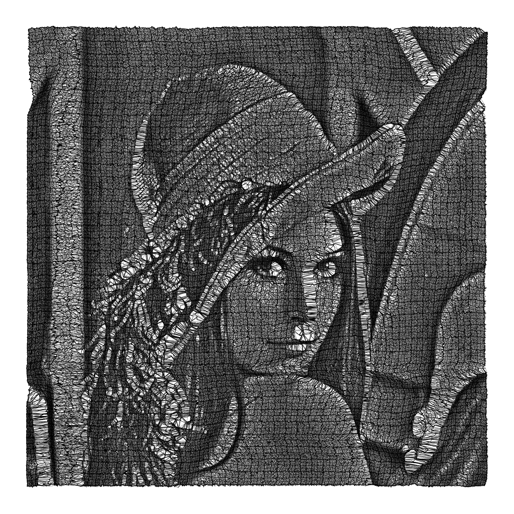
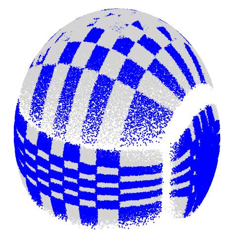
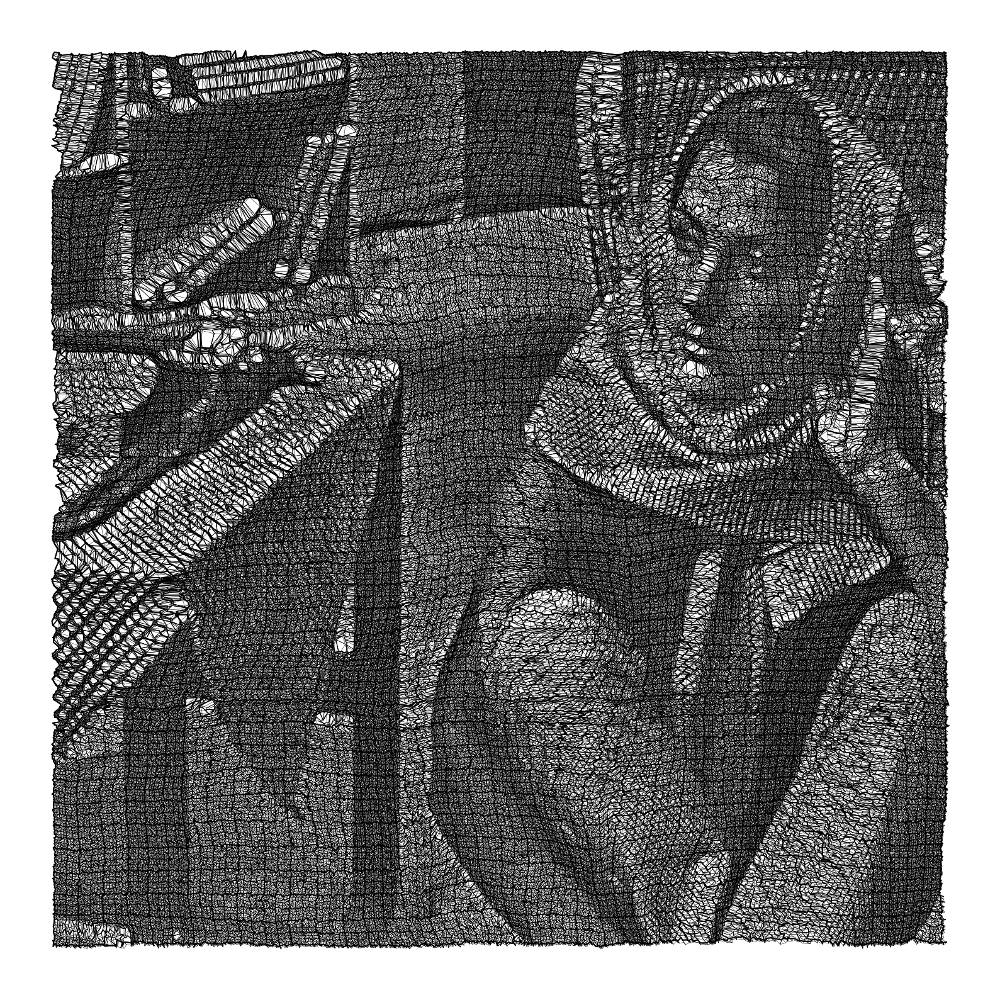

-----
[](https://colab.research.google.com/github/ArmanddeCacqueray/SquareNet/blob/main/exemples/00_getting_started.ipynb)
[](https://pypi.org/project/squarenet/)
[](https://squarenet.readthedocs.io/en/latest/)
<p align="center">
  
   
  
</p>
<p align="center">
  
  
  
</p>

❒  SquareNet

SquareNet maps unstructured **point clouds** to structured grids through a **bijective transformation**. It replaces expensive spatial queries (k-NN, radius search) with super fast **sliding window** operations. Think of it as a powerful alternative to kd-trees, voxelization, rasterization and neighborhood graphs.
✔ Works in any dimension
✔ Handles non-convex geometries
✔ Scales to millions of points (fast processing)

[Animation, click here✨](https://github.com/ArmanddeCacqueray/SquareNet/blob/main/gridification_paris.gif)
-----

## 🚀 Why SquareNet?

  * **Speed:** $O(N)$ local operations via vectorized sliding windows.
  * **Memory:** Contiguous memory access instead of irregular spatial lookups.
  * **Simplicity:** Pure NumPy-based logic, no heavy spatial dependencies.

## 📦 Installation

```bash
pip install squarenet
```

## 🧠 Quick Start 
-> exemples/00_getting_started.ipynb

```python
from squarenet import SquareNet
import numpy as np

# Initialize and Fit
N = 5*11*7*13
d = 4
points = np.random.rand(N, d)

IJKL = (5, 11, 7, 13)
sqnet = SquareNet(IJ_=IJKL) # Define grid dimensions, here 4D
sqnet.fit(points)

# Map any property of the points to the grid e.g. the norm, could be anything else
Xpts = np.linalg.norm(points, axis = 1) #(N, *C)
Xmap = sqnet.map(Xpts) #(5, 11, 7, 13, *C)
Xrec = sqnet.invert_map(Xmap)   #(N, *C) 
```
## Compute Local Views 
```python
# views enhance Xpts with a view in a rectangular neighborhood 
# (in the grid) with radius *wr and size *ws = 2wr+1
Xview = sqnet.views(Xpts, wr=5, invert_map = True) #(N, *C, *ws)
```

## 🗺️ Visualizing the Mapping

You can use the built-in checkerboard to verify neighborhood preservation:

```python
sqnet = SquareNet(IJ_=(400, 400))
sqnet.fit("ring")
sqnet.checkerboard()
```

```python
sqnet = SquareNet(IJ_=(400, 400))
sqnet.fit("france") #require !pip install shapely
sqnet.checkerboard()
```


## 📈 Key Applications

  * **Point Cloud Processing:** Fast local feature aggregation.
  * **Kernel Methods:** Efficient sparse approximation of large kernels.
  * **Deep Learning:** Pre-structuring irregular data for CNN/Transformer inputs.

<p align="center">
  
</p>
-----

**License:** MIT | **Author:** [ArmanddeCacqueray](mailto:armanddecacqueray@sfr.fr)
