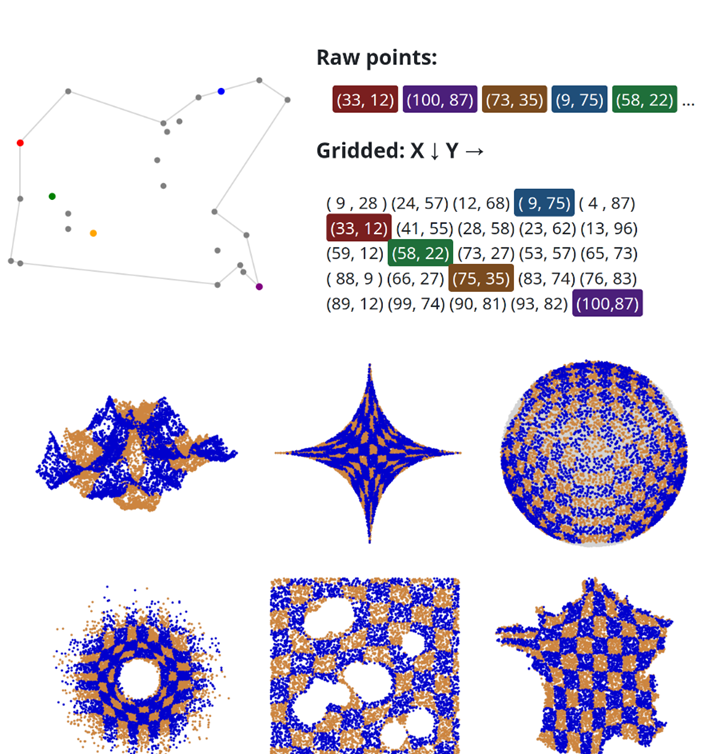

[](https://colab.research.google.com/github/Space-filling-net/SquareNet/blob/main/00_getting_started.ipynb)
[](https://pypi.org/project/squarenet/)
[](https://squarenet.readthedocs.io/en/latest/)
[](https://github.com/Space-filling-net/SquareNet)
[](https://huggingface.co/spaces/adec314/point-to-grid)

## ❒ SquareNet — Bijective Gridification of Point Clouds

This repository hosts the `SquareNet` python package for bijective gridification. SquareNet maps unstructured **point clouds** to structured grids through a **bijective transformation**: one point, one cell, no overlap, fully invertible.

The practical payoff: you replace expensive spatial queries (k-NN, radius search, neighborhood graphs) with plain tensor indexing. Think of it as an alternative to kd-trees, voxelization, rasterization, or graph-based approaches, but
with a regular tensor structure allowing for massive parallelisation.

✔ Works in any dimension  
✔ Handles non-convex geometries and irregular distributions  
✔ Scales to millions of points (seconds, not minutes)  
✔ Compatible with PyTorch and JAX  
✔ Native pading for mismatch between number of grid slots and number of points (since version 1.2)

---

## Example of gridification

<p align="center">

</p>

---

## 🚀 How it works

You initialize SquareNet with a target grid shape, then call `fit()` on your point cloud. Under the hood, the **Cartesian grid sort** algorithm rearranges point indices into structured grid multi-indices.

```
raw points      #(N, D)       →  sn.fit(X)        →  grid  #(N1, N2, ..., ND)
flat data       #(N, *C)      →  sn.map(X)        →  structured tensor  #(N1, ..., ND, *C)
structured tensor             →  sn.invert_map(X) →  back to flat view
```

The mapping is bijective, so `invert_map` is exact — no information lost.

---

## ⚙️ The Cartesian Grid Sort Algorithm

General Optimal Transport (the theoretically correct solution to gridification) is O(N²) to O(N³) — intractable at scale. [Cartesian-grid-sort](https://github.com/Space-filling-net/Cartesian-Grid-Sort) - see auxiliary repository - is a fast heuristic that exploits the tensor structure of the grid to sidestep that complexity.


### Three fitting modes

| Mode | How it works | When to use |
|---|---|---|
| `fast` (default) | Raw Cartesian sort | General use, large datasets |
| `robust` | Sorts subgrids at each step | Less prone to local minima |
| `ultimate` | Adds random shearing perturbations | Near-zero outliers, but slow and require tuning `max_iter` parameter (bigger = better, but depending on scale and geometry sometimes 100 iterations are fine, sometimes best results require 10_000 iterations = 20 minutes fit for 1-M points dataset) |

---

## 📦 Installation

```bash
pip install squarenet
```

---

## 🧠 Quick Start

→ See [`00_getting_started.ipynb`](https://colab.research.google.com/github/Space-filling-net/SquareNet/blob/main/00_getting_started.ipynb)

```python
from squarenet import SquareNet
import numpy as np

# 4D example: N points → 5×11×7×13 grid
N = 5 * 11 * 7 * 13
D = 4
X = np.random.rand(N, D)

sn = SquareNet(gridshape=(5, 11, 7, 13))
sn.fit(X)

# Inspect grid quality
sn.neighbormap()

# Map point data to grid and back
Xgrid = sn.map(X)         # shape (5, 11, 7, 13, D)
Xback = sn.invert_map(Xgrid)      # == X
```

### Approximate nearest-neighbor search

```python
point = np.random.rand(D)
index = sn.search_sorted(point)   # fast N-dimensional generalisation of  1D search sorted,
#will return a cell multi-index that best fit the given point (approximate method).
```

### Index conversions

Working on a subset? `mapidx` converts flat point indices to grid multi-indices and back.

```python
# Select points inside a disk, map their indices to the grid
sel = np.where(points[:, 0]**2 + points[:, 1]**2 <= 100) #raw indexes
gridsel = sn.mapidx(sel) #grid indexes
selback = sn.invert_mapidx(np.stack(gridsel, axis=1)) # == sel
```

### Visualizing the mapping

```python
sn = SquareNet(gridshape=(400, 400))
sn.fit("france")
sn.plot()
```

---

## 📈 When to use SquareNet

- **Point cloud processing** — fast spatial queries (neighbors, subsets) with contiguous memory lookup
and vectorized tensorial processing instead of irregular kd-tree/voxels data structure
- **Kernel methods** — efficient approximation of large Gram matrices via the grid structure
- **Deep learning** — convert flat point datasets into tensors ready for CNNs or attention-based models


**License:** MIT | **Author:** [ArmanddeCacqueray](mailto:armand.de-cacqueray-valmenier@eleves.enpc.fr)


